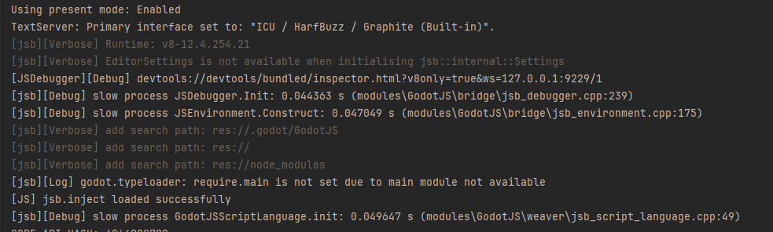

# Logging

All logging levels are defined in _jsb_log_severity.def.h_:

- `VeryVerbose`: very trivial messages (omitted by default even if `JSB_DEBUG` is on)
- `Verbose`: trivial messges (will not output in the editor panel)
- `Debug`: not important, also used by _console.debug_
- `Info`: general level, also used by _console.info_
- `Log`: used by _console.log_
- `Trace`: used by _console.trace_, with _stacktrace_ anyway
- `Warning`: used by _console.warn_
- `Error`: used by _console.error_, unexpected but not critical errors
- `Assert`: used by _console.assert_, print only if assertion failed
- `Fatal`: critial errors

By default, `VeryVerbose` is omitted at _compile-time_. You can change it in _jsb.config.h_ by setting `JSB_MIN_LOG_LEVEL` to `VeryVerbose`.  
`Verbose` messages will be displayed only if the `--verbose` flag is set on the command line for the godot executable, and they will appear exclusively in the console (launch from IDE, or start godot from the command line).

All messages start with a category name that indicates where they are originated:

- `JS`: messages from JS scripts (all `console.*` calls)
- `jsb`: all general messages in GodotJS
- `JSWorker`: messages from GodotJS worker implementation
- `JSDebugger`: messages from GodotJS debugger bridge
- `JSProcess`: sub-process spawned in GodotJS (`tsc` for instance)
- `JSExporter`: messages from the export plugin for packaging
- `jsc`: JavaScriptCore bridge implementation
- `quickjs`: QuickJS bridge implementation
- `web`: Web bridge implementation

