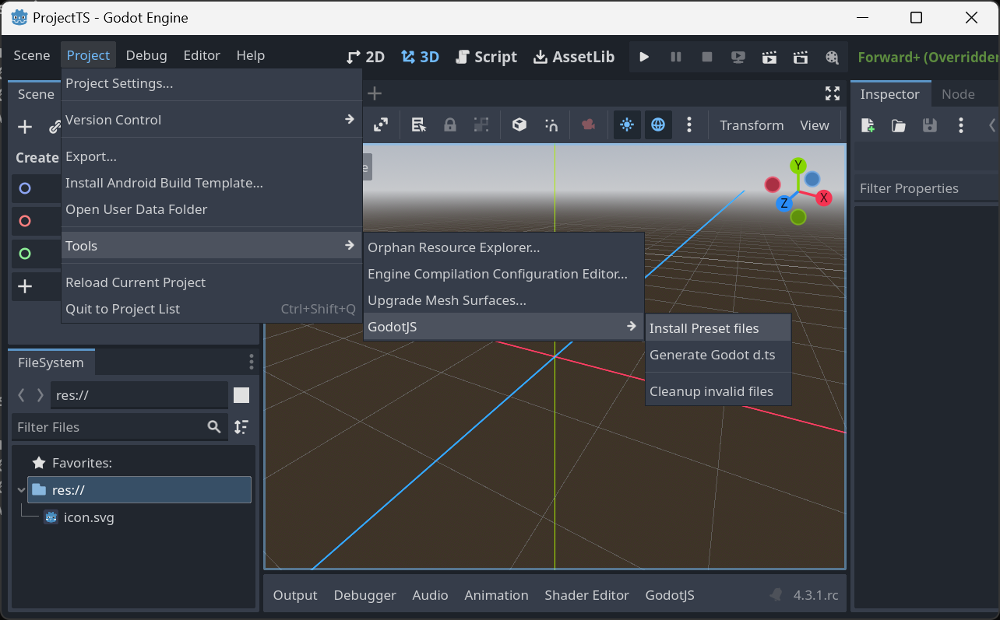
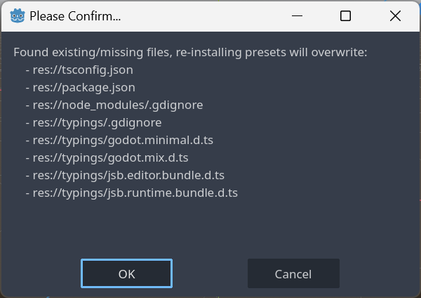
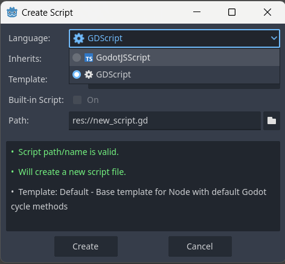
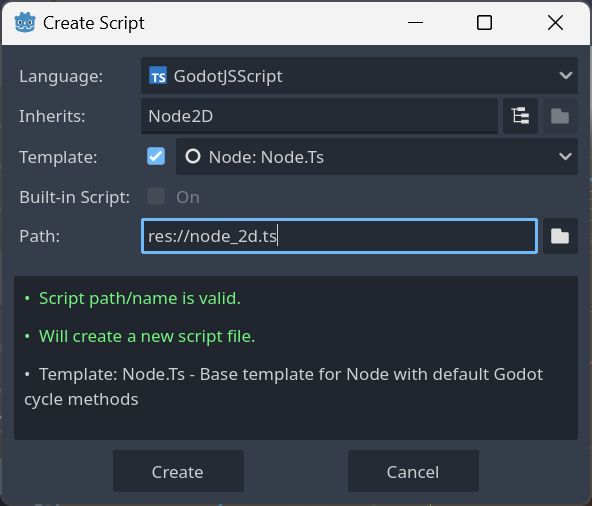
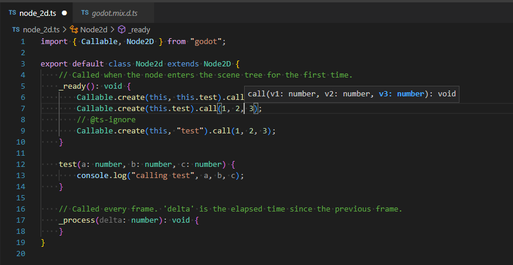
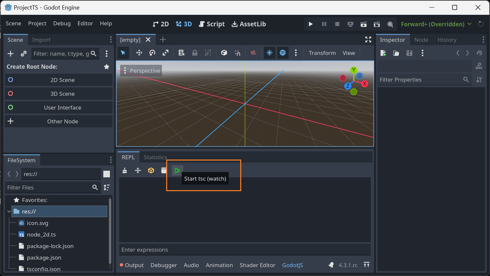

1. [Download the `editor`](https://github.com/godotjs/GodotJS/releases) based on your OS and select an JS engine (we recommend `v8` for a start) and unzip it
2. Rename the downloaded file based on your OS:
   - Linux: `godot.linuxbsd.editor.x86_64` ➡️ `godot`
   - MacOS: no rename required
   - Windows: `godot.windows.editor.x86_64.exe` ➡️ `godot.exe`
3. [Add Godot to your PATH](https://docs.godotengine.org/en/stable/tutorials/editor/command_line_tutorial.html#path)
   - Linux: `/usr/local/bin`
   - MacOS: `echo ~/your-path/Godot.app/Contents/MacOS|sudo tee /etc/paths.d/godot;bash -l;echo $PATH`
   - Windows: `setx /M path "%path%;C:\your-path\windows-editor-v8"`
4. Open a terminal
5. Test if you can use Godot via terminal and run:

```shell
godot --version
```

> **Note:** The `Godot.app` isn't signed for MacOS you need to [allow to open it](https://support.apple.com/en-us/102445#:~:text=If%20you%20want%20to%20open%20an%20app%20that%20hasn%E2%80%99t%20been%20notarized%20or%20is%20from%20an%20unidentified%20developer).

## Create a new project

### Automatically with [godot-ts](https://github.com/godotjs/godot-ts)

1. Run `npx -y @godot-js/godot-ts init` (new project will be crated at your current terminal path)
2. Follow the prompts
3. Run `cd <your-project>`
4. Run `npm i`
5. Run `npm run dev` - this will enable typescript watch mode and opens the editor
6. Inside the editor [install preset files](#install-preset-files) via `Project > Tools > GodotJS > Install Preset files`
7. Click `OK` to confirm a list of files will be generated in the project.
8. Attach the `example.ts` script to a node and run the project

### Manually

1. Run `godot -p` and create a new project
2. Inside the editor [install preset files](#install-preset-files) via `Project > Tools > GodotJS > Install Preset files`
3. Click `OK` to confirm a list of files will be generated in the project.
4. Run `cd <your-project>`
5. Run `npm i`
6. Run `npx tsc` to compile the typescript files

### Install Preset Files





## Create Scripts

To create new scripts, press select GodotJSScript as language:



Use the `Node: Node.Ts` template:



Open the project folder in you IDE, you should see full TypeScript support!



## Compile TypeScript Sources without [godot-ts](https://github.com/godotjs/godot-ts)

Before your scripts runnable in _Godot_, run `tsc` to compile typescript sources into javascript.

```sh
npx tsc

# or watch if you want
npx tsc -w
```

Also, you can simply click the tool button on _GodotJS_ bottom panel in the godot editor. It'll do the same thing for you.


