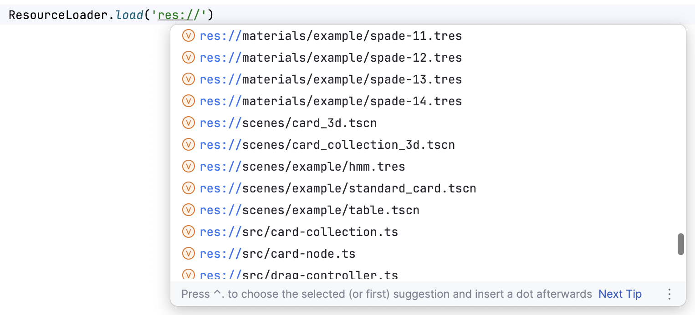
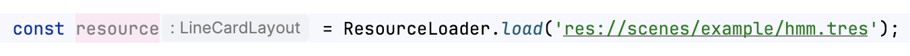
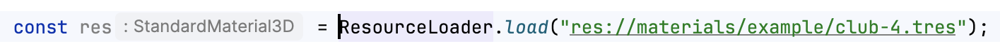
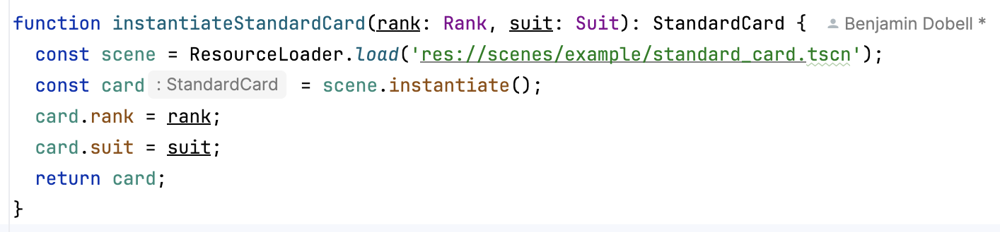
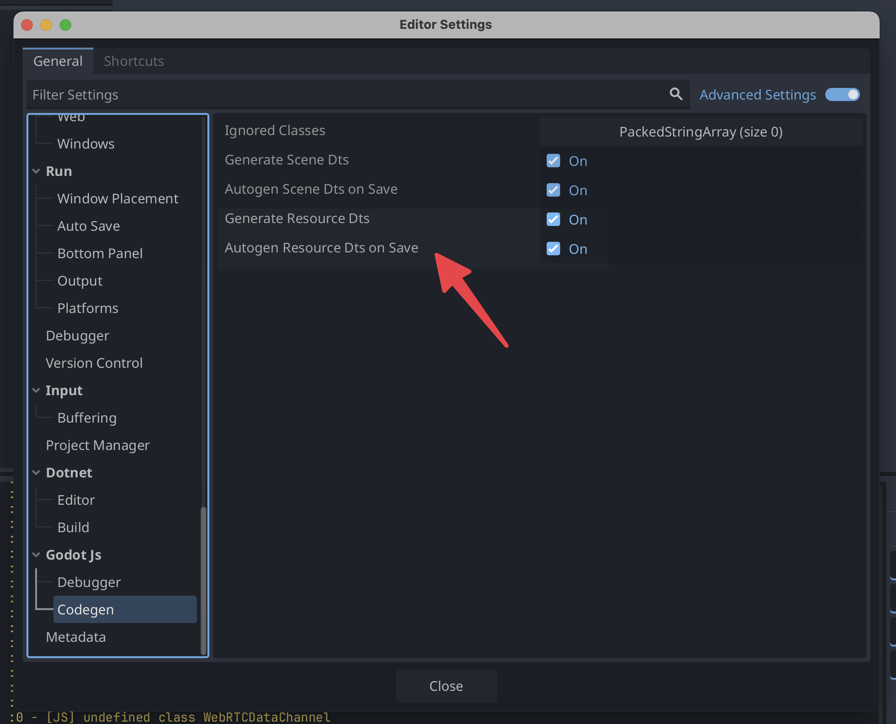

# Auto-Completion and Codegen

If you use TypeScript just follow the getting-started and install all [preset files](../getting-started.md#install-preset-files).

By default, the codegen is activated, which will generate new `*.d.ts` files based on you project resources.

Example given `ResourceLoader.load()` will autocomplete like this:



## .gen.d.ts files

Similarly to scenes, each resource has a generated `.gen.d.ts file` in the `/generated/typings/` subdirectory.

For example, a `hmm.tres` file for a custom Resource whose script looks like:

```ts
export default class LineCardLayout extends CardLayout {
```

will have the following `hmm.tres.gen.d.ts` generated:

```ts
import LineCardLayout from "../../../src/layouts/line-card-layout";
declare module "godot" {
  interface ResourceTypes {
    "res://scenes/example/hmm.tres": LineCardLayout;
  }
}
```

## ResourceLoader.load

Now when you write code to load a resource with a string literal, the type is known:



Built-in resource types are also typed as expected:



Unknown/non-literal resources will fall back to being typed as `Resource`, mimicking the old behavior.

## Scenes

We have special case handling for scenes.



In the example above, no explicit types are provided, but the instantiated scene is known to be of type `StandardCard`. This works because `PackedScene` is now `PackedScene<T extends Node = Node>` and the generated contents of `standard-card.tscn.gen.d.ts` are as follows:

```ts
import StandardCard from "../../../src/example/standard-card";
declare module "godot" {
  interface ResourceTypes {
    "res://scenes/example/standard_card.tscn": PackedScene<StandardCard>;
  }
}
```

## Settings

As with scene node codegen, resource codegen can be disabled with editor settings:



## Customization

As with scene node codegen, users can customize the generated type for custom `Resource` by exporting a `codegen` function and handling the codegen request of type `CodeGenType.ScriptResourceTypeDescriptor` e.g.

```ts
export const codegen: CodeGenHandler = (rawRequest) => {
  const request = rawRequest.proxy();

  switch (request.type) {
    case CodeGenType.ScriptResourceTypeDescriptor: {
      return GDictionary.create<StringLiteralTypeDescriptor>({
        type: DescriptorType.StringLiteral,
        value: "FooBar",
      });
    }
  }

  return undefined;
};
```

which would lead to the contents of `hmm.tres.gen.d.ts` becoming:

```ts
declare module "godot" {
  interface ResourceTypes {
    "res://scenes/example/hmm.tres": "FooBar";
  }
}
```

_**Note:** This is just for illustrative purposes. It's highly unlikely someone will implement a custom `Resource` that is somehow compliant with the string literal type `"FooBar"`!_
