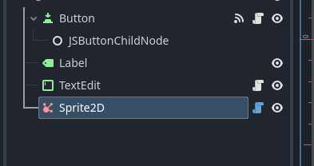
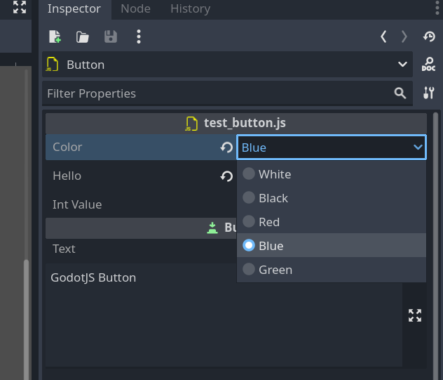

# Decorators

There are several decorators to help you define properties, signals, and other metadata for Godot objects.

## Signal annotation

You can define signals in your script using the `@signal` annotation:

```ts
import { Node, Signal0, Callable } from "godot";
import { signal } from "godot.annotations";

export default class MyJSNode extends Node {
  @signal()
  declare test!: Signal0;
}
```

For more information about signals, check this [link](signals.md).

## Tool annotation

If a GodotJS class is annotated with `tool()`, it'll be instantiated in the editor.

```ts
import { Node } from "godot";
import { tool } from "godot.annotations";

@tool()
export default class MyTool extends Node {
  _ready() {
    // This code will run in the editor
    console.log("MyTool is running in the editor");
  }
}
```

For more information about running code in editor, check this [link](code-in-editor.md).

## Icon annotation

An icon can be used as node icon in the editor scene hierarchy with the annotation `@icon`.

```ts
import { Sprite2D } from "godot";
import { icon } from "godot.annotations";

@icon("res://icon/affiliate.svg")
export default class MySprite extends Sprite2D {}
```



## Export Annotation

In `GodotJS`, class member properties/variables can be exported.
This means their value gets saved along with the resource
(such as the scene) they're attached to.
They will also be available for editing in the property editor.
Exporting is done by using the `@export_` annotation.

```ts
import { export_ } from "godot.annotations";

export default class Shooter extends Sprite2D {
  // type must be explicitly provided as the first parameter of @export_
  // cuz static type is actually a phantom in typescript
  @export_(Variant.Type.TYPE_FLOAT)
  speed: number = 0;

  // ...
}
```

In this example the value `0` will be saved and visible in the property editor.

The retrieval of default value is implemented through `Class Default Object (CDO)`.
`GodotJS` will instantiate a pure javascript instance of the script class
(`Shooter` in this example) as `CDO`, then the property value is read from
`CDO` as `default value` in the property editor.

> **NOTE:** Be cautious when coding within `constructor`, as it is probably called for initializing `CDO`.

### Basic Use

```ts
@export_(Variant.Type.TYPE_STRING)
address: string = "somewhere"; // `:string` can be omitted here

@export_(Variant.Type.TYPE_INT)
age: number = 0; // `:number` can be omitted here
```

If there's no default value, `default value` of the give type will be used (`0` in this case).

```ts
@export_(Variant.Type.TYPE_INT)
age: number;
```

### Exported Enum Properties

Enum value properties can be exported with the built-in support in the property editor.

> **NOTE:** So far, only `int` is supported as enum value.

```ts
@export_enum(MyColor)
color: MyColor = MyColor.White;
```

The value can be easily chosen from a dropdown list in the editor.


