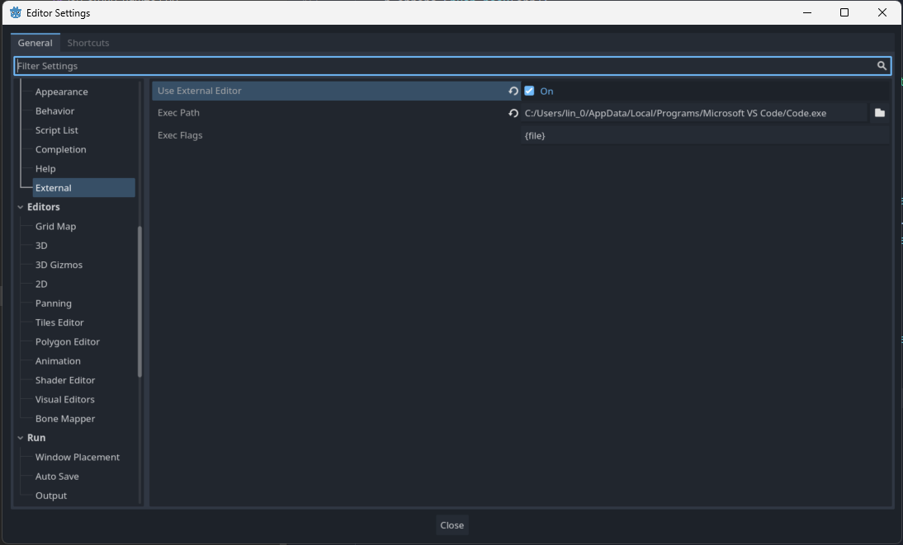

# Use External Editor

It's recommended to use external editor to write TypeScript.
Change the settings in `Editor > Edtior Settings > Text Editor > External`.

> **NOTE:** You might need to use the switch to enable `Advanced Settings`.

1. Check the `Use External Editor`
2. Add your path your desired editor to `Exec Path` - Check [this](https://docs.godotengine.org/en/stable/tutorials/editor/external_editor.html) for more information
3. For example write `{project} --line {line} {file}` for JetBrains products or `{project} --goto {file}:{line}:{col}` for VSCode to `Exec Flags`

