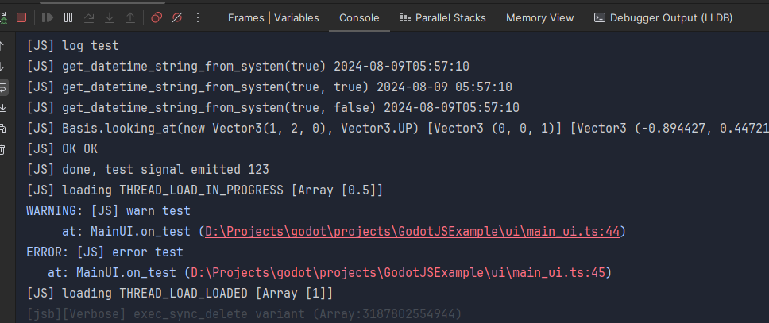

# SourceMaps

[A simple parser](https://github.com/godotjs/GodotJS/blob/main/internal/jsb_source_map.cpp) is implemented in `GodotJS`
to translate stacktrace info from javascript source position into typescript source position.

> **NOTE:** `inlineSourceMap` is not supported.
