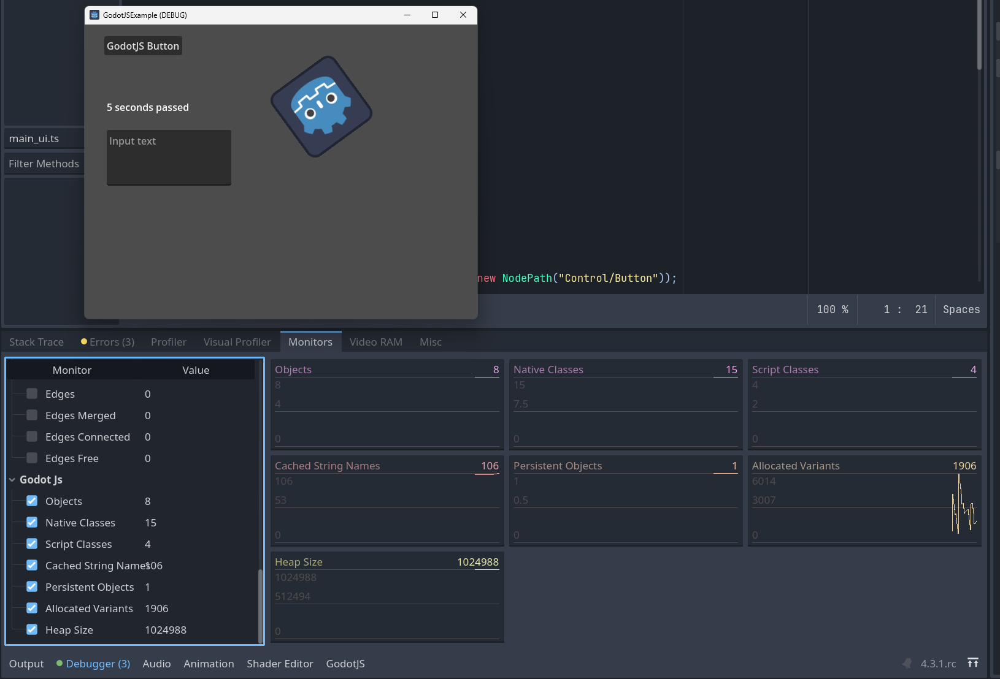
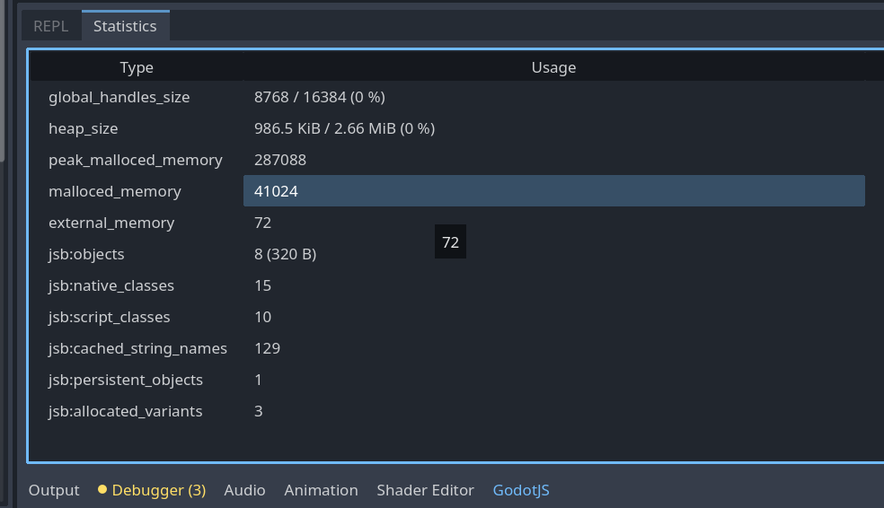

# Statistics

## Monitor

Run the project, switch to the editor while the project is running and open `Debugger > Monitors` at the bottom of the editor window.
Scroll down to `GodotJS` section and check available statistics of the running project. You should see a graph appearing as follows:

## Statistics

If you need to know the statistics of the JS environemnt running in the editor, open `GodotJS > Statistics` at the bottom of the editor window.
You will see a table as follows:

