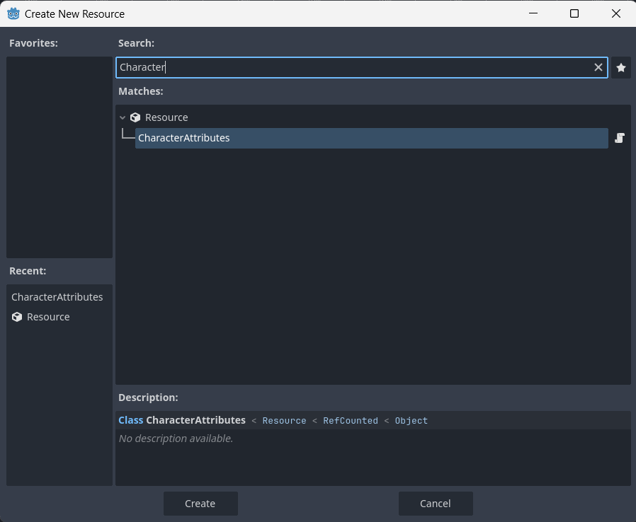
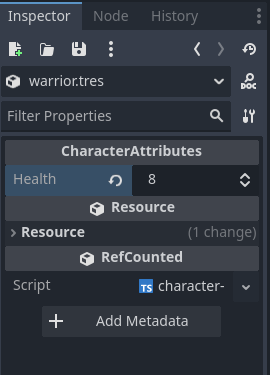
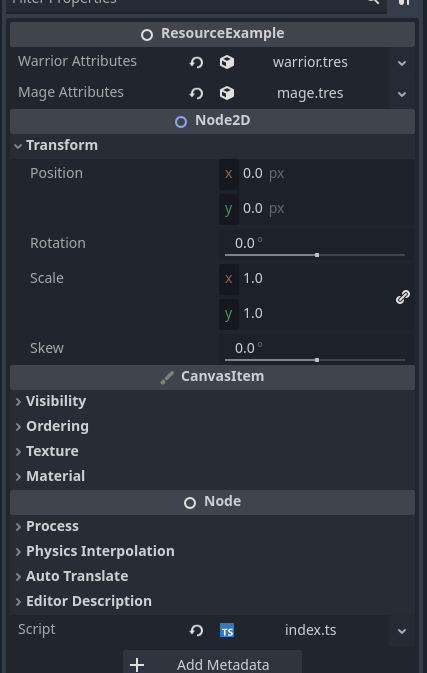

# Reuse custom resources

This example shows how to create a custom resource and reuse it with different settings.

## 1. Create custom resource

We create a new file `character-attributes.ts` and add this code to it:

```ts title="character-attributes.ts"
import { Export } from "godot.annotations";
import { Resource, Variant } from "godot";

export default class CharacterAttributes extends Resource {
  @Export(Variant.Type.TYPE_INT)
  health: number = 5;
}
```

## 2. Create new resources

1. Left-click on the `res://` folder in the file system.
2. Select `➕ Create New > 📦 Resource`
3. Search for `CharacterAttributes` and select it.
   
4. Save the resource as `warrior.tres`
5. Repeat the process and save it as `mage.tres`
6. Change the `health` property to `8` for the `warrior.tres` resource
   

## 3. Create a GodotJS class to consume the resources

Create a new file `index.ts` and add this code to it:

```ts title="index.ts"
import { Node, Variant } from "godot";
import { Export } from "godot.annotations";
import CharacterAttributes from "./character-attributes";

export default class ResourceExample extends Node {
  @Export(Variant.Type.TYPE_OBJECT)
  warriorAttributes: CharacterAttributes | undefined = undefined;

  @Export(Variant.Type.TYPE_OBJECT)
  mageAttributes: CharacterAttributes | undefined = undefined;

  _ready(): void {
    console.log("warrior health", this.warriorAttributes?.health);
    console.log("mage health", this.mageAttributes?.health);
  }
}
```

## 4. Create a node and add ResourceExample

1. Create a new scene and add a `Node` as root node.
2. Attach the `index.ts` script to the root node.
3. Select the root node and add the `warrior.tres` and `mage.tres` resources to the properties.
   You can drag and drop the resources from the file system into the properties.
   
4. Run the project and check the output in the console.
