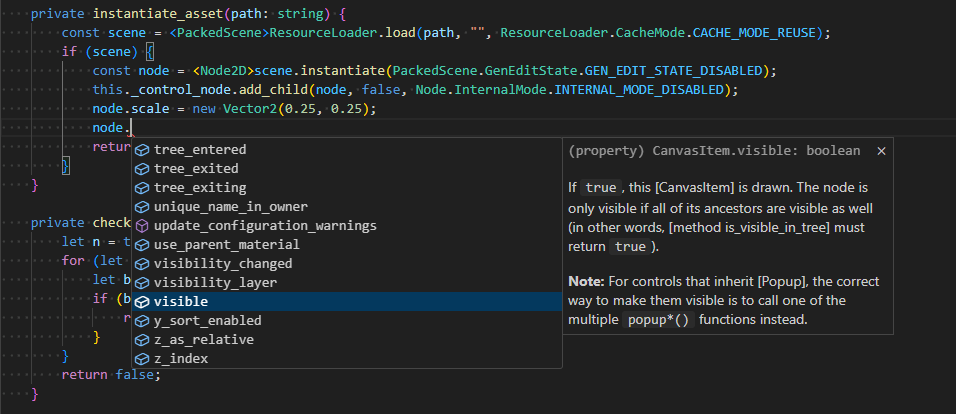
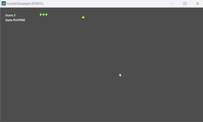
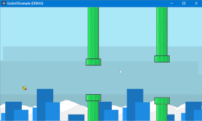

---
hide:
  - navigation
  - toc
---

# **GodotJS**

**_--  TypeScript/JavaScript Support for Godot 4.x by leveraging the high-performance capabilities of V8 to bring the delightful development experience of TypeScript into Godot.
--_**

Supports JavaScript engines:

- V8
- QuickJS
- JavaScriptCore
- Directly run scripts on the host browser JS VM when porting to web.

> **NOTE:** The core functionality is implemented and essentially usable but still under testing.

## Getting started

Read the [getting-started](documentation/getting-started).

## Features

- Godot ScriptLanguage integration
- Debug with Chrome/VSCode (with v8) and Safari (with JavaScriptCore)
- REPL in Editor
- Hot-reloading
- Support for multiple javascript engines ([v8](https://github.com/v8/v8), [quickjs](https://github.com/bellard/quickjs), [quickjs-ng](https://github.com/quickjs-ng/quickjs), [JavaScriptCore](https://developer.apple.com/documentation/javascriptcore), the host Browser JS)
- [Worker threads](documentation/experimental/worker.md) (limited support) (**experimental**)
- Asynchronously loaded modules (limited support) (_temporarily only available in v8.impl, quickjs.impl_)

## Getting the engine

No installation or setup necessary.
The binaries for download are the complete, usable Godot editor
and engine with JavaScript/TypeScript language support.

### Binary downloads

Download the binaries from the [Releases](https://github.com/godotjs/GodotJS/releases).

### Choose your engine

Before initiating, make sure to select the JavaScript runtime you prefer between `v8`, `QuickJS` and `Web` (See [Supported Platforms](#supported-platforms)):

- `v8` is proven to be one of the most powerful and high-performance JavaScript runtimes.
- `QuickJS` is a remarkable and lightweight option.
- `JavaScriptCore` is the built-in JavaScript engine for WebKit and bundled with macOS/iOS.
- `Web` is only suitable when building for Web. All scripts run on the host browser JS VM rather than an additional interpreter.

### Building from source

In some cases you want or need to build the engine from source.
Read the [Building from Source](documentation/building-from-source/) documentation in this case.

## Examples

For more information on how to use `GodotJS` in a project, check out [GodotJSExample](https://github.com/ialex32x/GodotJSExample.git) for examples written in typescript.

## Supported Platforms

|                | v8               | quickjs         | quickjs-ng      | Web Builtin JS      | JavaScriptCore  |
| -------------- | ---------------- | --------------- | --------------- | ------------------- | --------------- |
| Windows:x86_64 | ✅               | ✅              | ✅              | ❌                  | ❌              |
| Windows:arm64  | ✅               | ✅              | ✅              | ❌                  | ❌              |
| MacOS:x86_64   | ✅ (not tested)  | ✅ (not tested) | ✅ (not tested) | ❌                  | ✅ (not tested) |
| MacOS:arm64    | ✅               | ✅              | ✅              | ❌                  | ✅ (debugging)  |
| Linux:x86_64   | ✅ (not tested)  | ✅ (not tested) | ✅              | ❌                  | ❌              |
| Linux:arm64    | ✅               | ✅              | ✅              | ❌                  | ❌              |
| Android:x86_64 | ✅ (not tested)  | ✅ (not tested) | ✅ (not tested) | ❌                  | ❌              |
| Android:arm64  | ✅               | ✅ (not tested) | ✅ (not tested) | ❌                  | ❌              |
| iOS:x86_64     | ✅ (not tested)  | ✅ (not tested) | ✅ (not tested) | ❌                  | ✅ (not tested) |
| iOS:arm64      | ✅ (not tested)  | ✅ (not tested) | ✅ (not tested) | ❌                  | ✅ (not tested) |
| Web:wasm32     | ❌               | ✅ (not tested) | ✅ (not tested) | ✅ (debugging)      | ❌              |
| Debugger       | ✅ Chrome/VSCode | ❌              | ❌              | ✅ browser devtools | ✅ Safari       |

> Android: only tested on ndk_platform=android-24  
> Web: only tested on emsdk-3.1.64  
> JavaScriptCore: macOS 15, iOS 18 (support for lower versions may be implemented in future versions)
